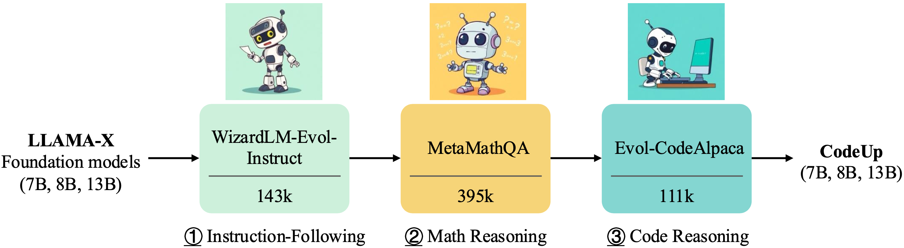
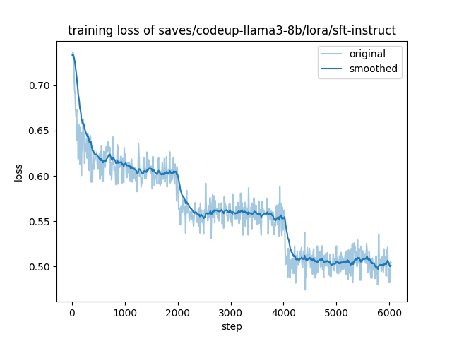
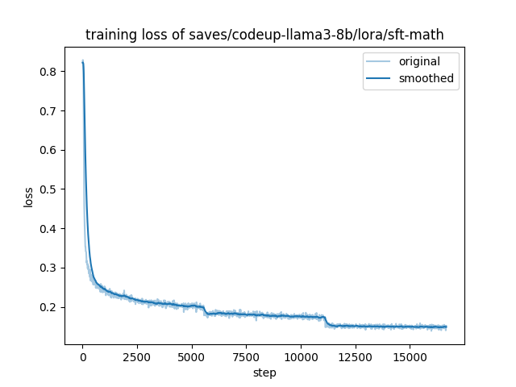
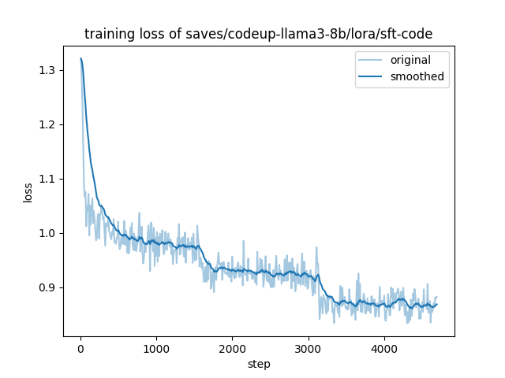
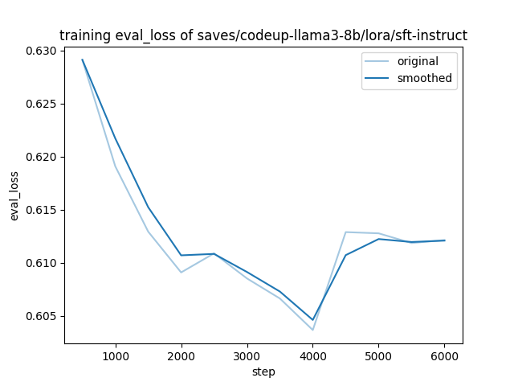
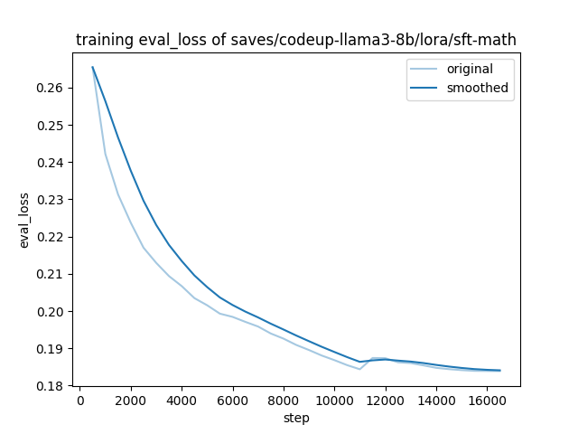
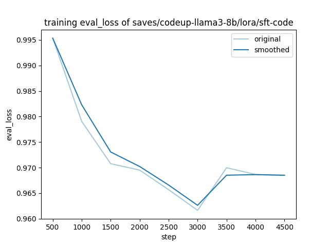

<p align="center" width="100%">

</p>

# CodeUp: A Multilingual Code Generation Llama-X Model with Parameter-Efficient Instruction-Tuning

[](https://github.com/juyongjiang/CodeUp/blob/master/LICENSE)
[](https://github.com/juyongjiang/CodeUp/blob/master/data/DATA_LICENSE)
[](https://www.python.org/downloads/release/python-390/)
[](https://github.com/psf/black)

## Table of Contents
- [Overview](#overview)
- [Dataset Preparation](#dataset-preparation)
- [Prompt Template](#prompt-template)
- [Fine-tuning](#fine-tuning)
- [Evaluation](#evaluation)
- [Useful Resources](#useful-resources)
  - [LLMs](#llms)
  - [CPU Running](#cpu-running)
  - [Interface](#interface)
  - [Dataset](#dataset)
  - [Evaluation](#evaluation-1)
  - [Hugging Face](#hugging-face)
  - [Papers](#papers)
- [Citation](#citation)
- [Star History](#star-history)

## Overview
In recent years, large language models (LLMs) have demonstrated exceptional capabilities across a wide range of applications, largely due to their remarkable emergent abilities. To better align these models with human preferences, techniques such as instruction-tuning and reinforcement learning from human feedback (RLHF) have been developed for chat-based LLMs, including models like ChatGPT and GPT-4. However, except for Codex, these general-purpose LLMs primarily focus on general domains and are not specifically optimized for coding tasks. Codex, while a viable option, is a closed-source model developed by OpenAI. This underscores the need for developing open-source, instruction-following LLMs tailored to the code domain.
The development of such models, however, faces significant challenges due to the extensive number of parameters (≥ 7 billion) and the vast datasets required for training. These factors demand substantial computational resources, which can hinder training and inference on consumer hardware.
To address these challenges, our project leverages the latest powerful foundation model, `Llama` with version `X`, termed `Llama-X`, to construct high-quality instruction-following datasets for code generation tasks. We propose the development of an instruction-following multilingual code generation model based on Llama-X. 
To ensure that our approach is feasible within an academic budget and can be executed on consumer hardware, such as a single RTX 3090, we are inspired by Alpaca-LoRA to integrate advanced parameter-efficient fine-tuning (PEFT) methods like `LoRA` for the code domain. 
These methods facilitate the efficient adaptation of pre-trained language models (PLMs, also known as foundation models) to various downstream applications without the need to fine-tune the entire model's parameters. 
The overall training pipeline for CodeUp is outlined as follows.

<p align="center" width="100%">

</p>


## Dataset Preparation

We employ three distinct datasets to specialize the Llama-X foundataion models for code generation:

* **[WizardLMTeam/WizardLM_evol_instruct_V2_196k](https://huggingface.co/datasets/WizardLMTeam/WizardLM_evol_instruct_V2_196k)**: This dataset comprises 143k rows of evolved data from Alpaca and ShareGPT. Due to licensing requirements, you must merge the original ShareGPT data with this dataset to obtain the complete version, which will contain approximately 196k rows.

* **[meta-math/MetaMathQA](https://huggingface.co/datasets/meta-math/MetaMathQA)**: The MetaMathQA dataset is augmented using the training sets from GSM8K and MATH, ensuring that no data from the testing sets is included.

* **[theblackcat102/evol-codealpaca-v1](https://huggingface.co/datasets/theblackcat102/evol-codealpaca-v1)**: This dataset is developed using a methodology similar to WizardCoder, with the distinction that it is open-source. It leverages the gpt-4-0314 and gpt-4-0613 models for generating and answering responses, with the majority of the generation process being handled by gpt-4-0314.


## Prompt Template

In line with previous research, we use the prompt template found in `templates/alpaca.json` for instruction-tuning the model for code generation. However, during inference, such as in the web demo, we utilize the user's instruction with an empty input field.

```
Below is an instruction that describes a task, paired with an input that provides further context. Write a response that appropriately completes the request.

### Instruction:
{instruction}

### Input:
{input}

### Response:
```

<div align="right">
    <b><a href="#table-of-contents">↥ back to top</a></b>
</div>

## Fine-tuning

> [!IMPORTANT]
> We use the awesome LLaMA-Factory framework to fine-tune the Llama-X model. Installation LLaMA-Factory is mandatory. For more details, please check https://github.com/hiyouga/LLaMA-Factory.
> Eight NVIDIA A100 80G GPU will be used for fine-tuning. The adapters and merged models will be saved in `saves` and `models` folders.

```bash
# install llama-factory
conda create -n llamafactory python=3.11
conda activate llamafactory

git clone --depth 1 https://github.com/hiyouga/LLaMA-Factory.git
cd LLaMA-Factory
pip install -e ".[torch,metrics]"
```

Then, run the following commands:

```bash
# 1. instruction-following
llamafactory-cli train codeup/llama3_lora_sft_instruct.yaml
llamafactory-cli export codeup/llama3_lora_sft_merge_instruct.yaml

# 2. math reasoning
llamafactory-cli train codeup/llama3_lora_sft_math.yaml
llamafactory-cli export codeup/llama3_lora_sft_merge_math.yaml

# 3. code reasoning
llamafactory-cli train codeup/llama3_lora_sft_code.yaml
llamafactory-cli export codeup/llama3_lora_sft_merge_code.yaml
```

or 

```bash
bash run_train_codeup.sh 2>&1 | tee train_codeup.log
```


The training and evaluation loss of CodeUp at each stage is shown below.

| ① sft-instruct | ② sft-math  | ③ sft-code |
| -- | -- | -- |
| <center></center> | <center></center>  | <center></center> | 
| <center></center> | <center></center>  | <center></center> | 


<div align="right">
    <b><a href="#table-of-contents">↥ back to top</a></b>
</div>


## Evaluation

> [!IMPORTANT]
> We use the evaluation script from the SelfCodeAlign repository to fine-tune the Llama-X model. For more details, please check https://github.com/bigcode-project/selfcodealign.
> One NVIDIA A100 80G GPU will be used for evaluation. 

```bash
conda create -n selfcodealign python=3.10.0
conda activate selfcodealgin

git clone git@github.com:bigcode-project/selfcodealign.git
pip install -i https://pypi.tuna.tsinghua.edu.cn/simple -e .

# Failed to initialize NumPy: _ARRAY_API not found and BERTModel weight initialization issue
pip install --force-reinstall -v "numpy==1.25.2" -i https://pypi.tuna.tsinghua.edu.cn/simple
# fast_tokenizer = TokenizerFast.from_file(fast_tokenizer_file) Exception: data did not match any variant of untagged enum ModelWrapper at line 1251003 column 
pip install --upgrade "transformers>=4.45" -i https://pypi.tuna.tsinghua.edu.cn/simple
```

Then, run the following commands:

```bash
bash run_eval_codeup.sh
```

The batch inference using [vLLM](https://docs.vllm.ai/en/latest/) can significantly speed up the evaluation. The greedy decoding strategy will be adopted and can be completed within 20 seconds.

The Pass@1 (%) of the CodeUp versus Meta-LLaMA-3-8B base model on the HumanEval and EvalPlus benchmarks using greedy decoding is reported in Table below.

| Model | Instruction Data | HumanEval | HumanEval+ | MBPP | MBPP+ |
| --- | --- | --- | --- | --- | --- |
| LLaMA3 8B | - | 0.262 | 0.232 | 0.003 | 0.003 |
| CodeUp | ③ Code | 0.384   | 0.360 | 0.356 | 0.263 |
|  | ③ Code + ① Instruct | 0.445 | 0.378 | 0.383 | 0.291 |
|  | ③ Code + ② Math | 0.317 | 0.293 | 0.371 | 0.281 |
|  | ③ Code + ② Math + ① Instruct | **0.482** | **0.402** | **0.414**  | **0.306** |

Here are the insights we have observed:

* **(③ Code + ① Instruct) > (③ Code) Enhancing Code Generation through Instruction Training**: Training the base model with both text-based instructions and code data (③ Code + ① Instruct) yields better results than using code data alone (③ Code). This approach ensures the model comprehends instructions effectively before learning to generate code.

* **(③ Code + ② Math) < (③ Code) Impact of Math Reasoning on Code Generation**: Integrating math reasoning data with code data (③ Code + ② Math) is less effective than using only code data (③ Code). The disparity in data distribution between mathematical reasoning and code reasoning complicates the model's ability to translate mathematical logic into coding structures.

* **(③ Code + ② Math + ① Instruct) > (③ Code + ① Instruct) Leveraging Instruction and Math for Enhanced Coding**: When a model already excels in following instructions, combining math reasoning, code, and instruction data (③ Code + ② Math + ① Instruct) surpasses the results obtained by using only instruction and code data (③ Code + ① Instruct). The model efficiently acquires useful mathematical logic, which enhances its coding capabilities.


<div align="right">
    <b><a href="#table-of-contents">↥ back to top</a></b>
</div>

## Useful Resources
### LLMs
- [LLaMA](https://github.com/facebookresearch/llama), inference code for LLaMA models
- [Llama 2](https://ai.meta.com/research/publications/llama-2-open-foundation-and-fine-tuned-chat-models/), open foundation and fine-tuned chat models
- [Stanford Alpaca](https://github.com/tatsu-lab/stanford_alpaca), an instruction-following LLaMA model
- [Alpaca-Lora](https://github.com/tloen/alpaca-lora), instruct-tune LLaMA on consumer hardware
- [FastChat](https://github.com/lm-sys/FastChat), an open platform for training, serving, and evaluating large language models. Release repo for Vicuna and Chatbot Arena.
- [GPT Code UI](https://github.com/ricklamers/gpt-code-ui), an open source implementation of OpenAI's ChatGPT Code interpreter
- [PEFT](https://github.com/huggingface/peft), state-of-the-art parameter-efficient fine-tuning (PEFT) methods
- [Codex](https://github.com/openai/human-eval), an evaluation harness for the HumanEval problem solving dataset
- [Code Alpaca](https://github.com/sahil280114/codealpaca), an instruction-following LLaMA model trained on code generation instructions
- [WizardLM](https://github.com/nlpxucan/WizardLM), an instruction-following LLM using Evol-Instruct
- [Self-Instruct](https://github.com/yizhongw/self-instruct), aligning pretrained language models with instruction data generated by themselves.
- [StackLLaMA](https://huggingface.co/blog/stackllama), a hands-on guide to train LLaMA with RLHF
- [StarCoder](https://github.com/bigcode-project/starcoder), a language model (LM) trained on source code and natural language text.
- [CodeGeeX](https://github.com/THUDM/CodeGeeX), a multilingual code generation model
- [CodeGen](https://github.com/salesforce/CodeGen), an open large language model for code with multi-turn program synthesis
- [InCoder](https://github.com/dpfried/incoder), a generative model for code infilling and synthesis 
- [CodeT5+](https://github.com/salesforce/CodeT5), a standard Transformer framework for code understanding and generation
- [CodeBERT](https://github.com/microsoft/CodeBERT), a pre-trained language model for programming and natural languages

### CPU Running
- [llama.cpp](https://github.com/ggerganov/llama.cpp), a native client for running LLaMA models on the CPU
- [alpaca.cpp](https://github.com/antimatter15/alpaca.cpp), a native client for running Alpaca models on the CPU

### Interface
- [Alpaca-LoRA-Serve](https://github.com/deep-diver/Alpaca-LoRA-Serve), a ChatGPT-style interface for Alpaca models

### Dataset
- [AlpacaDataCleaned](https://github.com/gururise/AlpacaDataCleaned), a project to improve the quality of the Alpaca dataset
- [GPT-4 Alpaca Data](https://github.com/Instruction-Tuning-with-GPT-4/GPT-4-LLM), a project to port synthetic data creation to GPT-4
- [Code Alpaca Data](https://github.com/sahil280114/codealpaca/tree/master/data), a project for code generation
- [CodeXGLUE](https://github.com/microsoft/CodeXGLUE), a machine learning benchmark dataset for code understanding and generation
- [HumanEval](https://github.com/openai/human-eval), [APPS](https://huggingface.co/datasets/codeparrot/apps), [HumanEval+](https://github.com/evalplus/evalplus), [MBPP](https://huggingface.co/datasets/mbpp), and [DS-1000](https://github.com/HKUNLP/DS-1000)

### Evaluation
- [Multilingual Code Models Evaluation Leadboard](https://huggingface.co/spaces/bigcode/multilingual-code-evals)
- [Code Generation LM Evaluation Harness](https://github.com/bigcode-project/bigcode-evaluation-harness)

### Hugging Face
- [https://huggingface.co/decapoda-research/llama-7b-hf](https://huggingface.co/decapoda-research/llama-7b-hf)
- [https://huggingface.co/tloen/alpaca-lora-7b](https://huggingface.co/tloen/alpaca-lora-7b)
- [https://huggingface.co/meta-llama/Llama-2-7b-hf](https://huggingface.co/meta-llama/Llama-2-7b-hf)
- [https://huggingface.co/chansung/gpt4-alpaca-lora-7b](https://huggingface.co/chansung/gpt4-alpaca-lora-7b)

### Papers
- [A Survey on Large Language Models for Code Generation](https://arxiv.org/abs/2406.00515)
- [A Survey of Large Language Models](https://arxiv.org/abs/2303.18223)
- [Codex: Evaluating Large Language Models Trained on Code](https://arxiv.org/pdf/2107.03374)
- [LLaMA: Open and Efficient Foundation Language Models](https://arxiv.org/abs/2302.13971v1)
- [Llama 2: Open Foundation and Fine-Tuned Chat Models](https://scontent-nrt1-1.xx.fbcdn.net/v/t39.2365-6/10000000_662098952474184_2584067087619170692_n.pdf?_nc_cat=105&ccb=1-7&_nc_sid=3c67a6&_nc_ohc=ByL78P2ckIMAX8bqkga&_nc_ht=scontent-nrt1-1.xx&oh=00_AfDo3G6cAzYUombvtIceZm9x3NY0jg5mT_L4yEnXodk40w&oe=64C84A3F)
- [Self-Instruct: Aligning Language Model with Self Generated Instructions](https://arxiv.org/abs/2212.10560)
- [LoRA: Low-Rank Adaptation of Large Language Models](https://arxiv.org/abs/2106.09685)
- [InstructGPT: Training language models to follow instructions with human feedback](https://arxiv.org/abs/2203.02155)
- [Emergent Abilities of Large Language Models](https://arxiv.org/abs/2206.07682)
- [StarCoder: may the source be with you!](https://arxiv.org/abs/2305.06161)
- [WizardCoder: Empowering Code Large Language Models with Evol-Instruct](https://arxiv.org/abs/2306.08568)
- [CodeGeeX: A Pre-Trained Model for Code Generation with Multilingual Evaluations on HumanEval-X](https://arxiv.org/abs/2303.17568)
- [CodeT5+: Open Code Large Language Models for Code Understanding and Generation](https://arxiv.org/abs/2305.07922)
- [CodeGen: An Open Large Language Model for Code with Multi-Turn Program Synthesis](https://arxiv.org/abs/2203.13474)
- [InCoder: A Generative Model for Code Infilling and Synthesis](https://arxiv.org/abs/2204.05999)
- [CodeBERT: A Pre-Trained Model for Programming and Natural Languages](https://arxiv.org/abs/2002.08155)
- [CodeXGLUE: A Machine Learning Benchmark Dataset for Code Understanding and Generation](https://arxiv.org/abs/2102.04664)


<div align="right">
    <b><a href="#table-of-contents">↥ back to top</a></b>
</div>

## Citation
> [!IMPORTANT]
> 
> If you use the data or code in this repo, please consider citing the following paper:

```BibTex
@misc{codeup,
  author = {Juyong Jiang and Sunghun Kim},
  title = {CodeUp: A Multilingual Code Generation Llama-X Model with Parameter-Efficient Instruction-Tuning},
  year = {2023},
  publisher = {GitHub},
  journal = {GitHub repository},
  howpublished = {\url{https://github.com/juyongjiang/CodeUp}},
}

@article{jiang2024survey,
  title={A Survey on Large Language Models for Code Generation},
  author={Jiang, Juyong and Wang, Fan and Shen, Jiasi and Kim, Sungju and Kim, Sunghun},
  journal={arXiv preprint arXiv:2406.00515},
  year={2024}
}

@inproceedings{zheng2024llamafactory,
  title={LlamaFactory: Unified Efficient Fine-Tuning of 100+ Language Models},
  author={Yaowei Zheng and Richong Zhang and Junhao Zhang and Yanhan Ye and Zheyan Luo and Zhangchi Feng and Yongqiang Ma},
  booktitle={Proceedings of the 62nd Annual Meeting of the Association for Computational Linguistics (Volume 3: System Demonstrations)},
  address={Bangkok, Thailand},
  publisher={Association for Computational Linguistics},
  year={2024},
  url={http://arxiv.org/abs/2403.13372}
}

@article{wei2024selfcodealign,
  title={SelfCodeAlign: Self-Alignment for Code Generation}, 
  author={Yuxiang Wei and Federico Cassano and Jiawei Liu and Yifeng Ding and Naman Jain and Zachary Mueller and Harm de Vries and Leandro von Werra and Arjun Guha and Lingming Zhang},
  year={2024},
  journal={arXiv preprint arXiv:2410.24198}
}
```

<div align="right">
    <b><a href="#table-of-contents">↥ back to top</a></b>
</div>

## Star History

[](https://star-history.com/#juyongjiang/CodeUp&Date)
