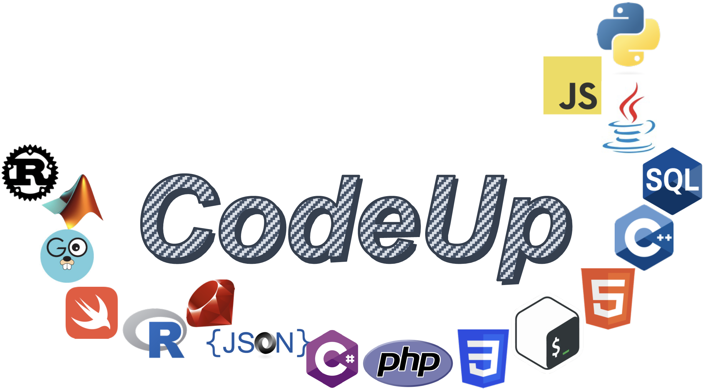
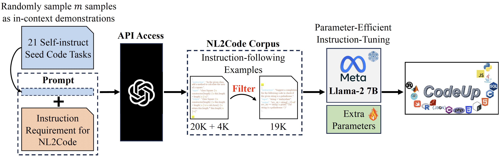
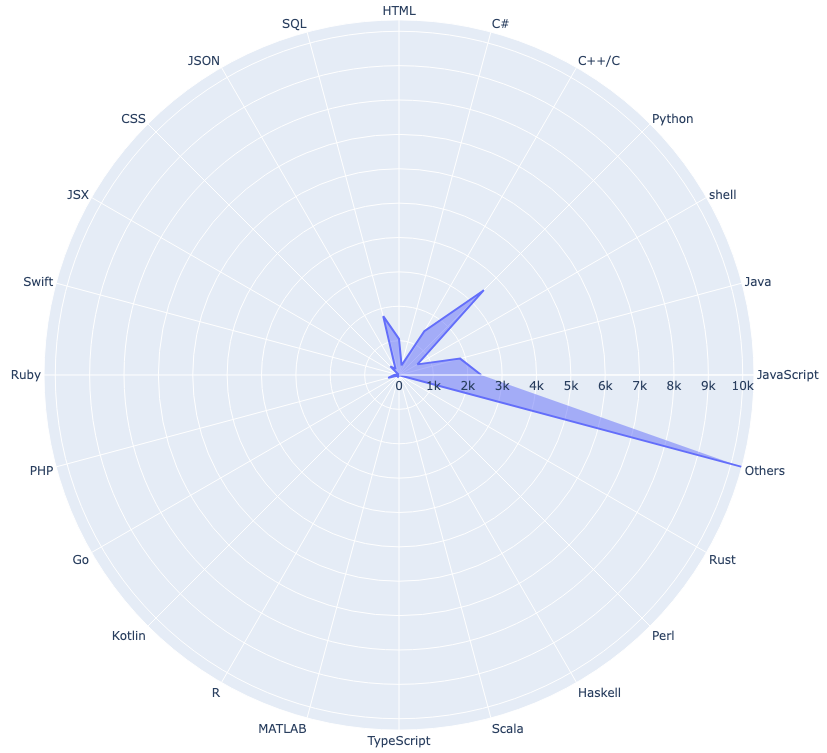
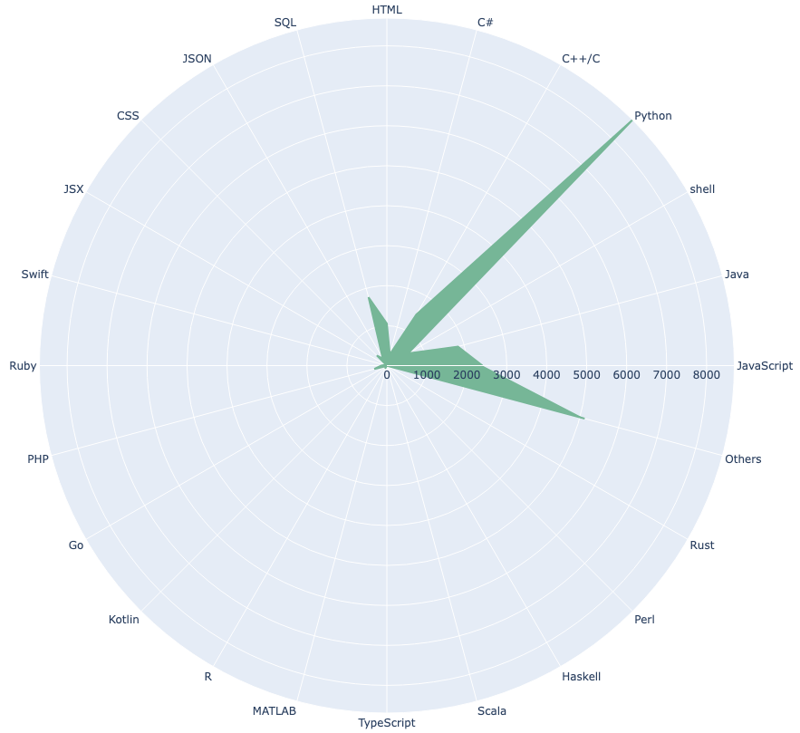
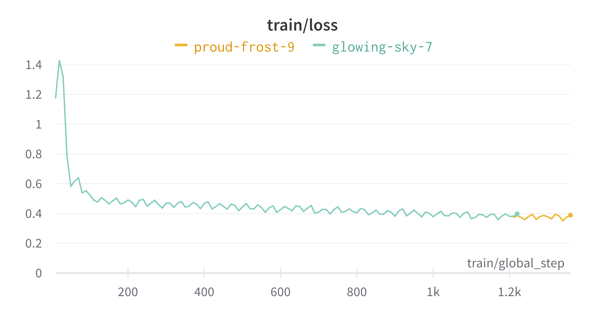
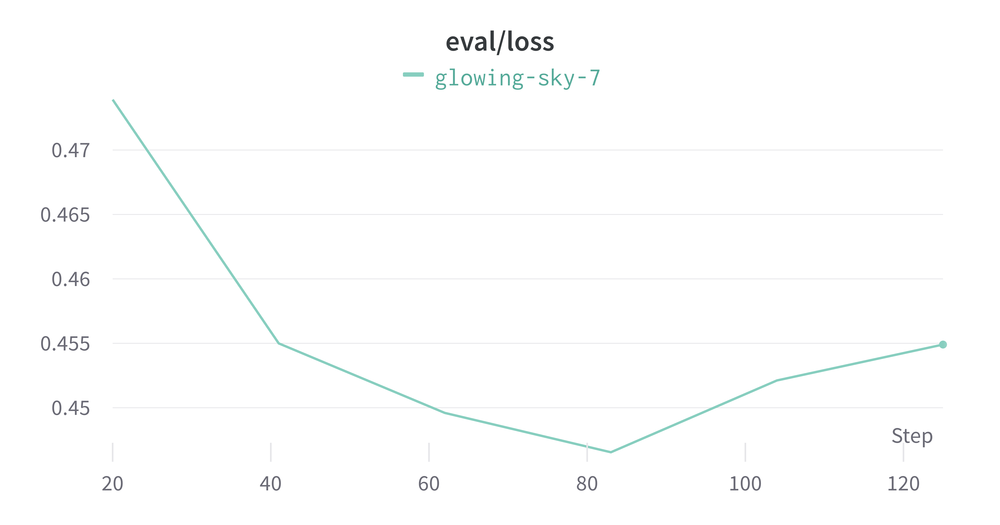
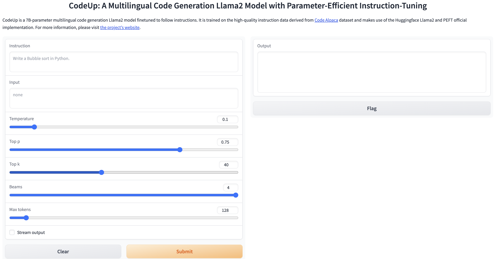

<p align="center" width="100%">

</p>

# CodeUp: A Multilingual Code Generation Llama2 Model with Parameter-Efficient Instruction-Tuning

[](https://github.com/juyongjiang/CodeUp/blob/master/LICENSE)
[](https://github.com/juyongjiang/CodeUp/blob/master/data/DATA_LICENSE)
[](https://www.python.org/downloads/release/python-390/)
[](https://github.com/psf/black)

## Overview
In recent years, large language models (LLMs) have shown exceptional capabilities in a wide range of applications due to their fantastic emergence ability. To align with human preference, instruction-tuning and reinforcement learning from human feedback (RLHF) are proposed for Chat-based LLMs (e.g., ChatGPT, GPT-4). However, these LLMs (except for Codex) primarily focus on the general domain and are not specifically designed for the code domain. Although Codex provides an alternative choice, it is a closed-source model developed by OpenAI. Hence, it is imperative to develop open-source instruction-following LLMs for the code domain. 
However, the large-scale number of LLMs' parameters ($\ge$7B) and training datasets require a vast amount of computational resources, which significantly impedes the development of training and inference on consumer hardware. 

To handle these challenges, in this project, we adopt the latest powerful foundation model `Llama 2` and construct high-quality instruction-following data for code generation tasks, and propose an instruction-following multilingual code generation Llama2 model. Meanwhile, to make it fit an academic budget and consumer hardware (e.g., a single RTX 3090) based on `Alpaca-LoRA`, we equip `CodeUp` with the advanced parameter-efficient fine-tuning (PEFT) methods (e.g., [LoRA](https://arxiv.org/abs/2106.09685)) which enable efficient adaptation of pre-trained language models (PLMs, also known as foundation model) to various downstream applications without fine-tuning the entire model's parameters. The overall training recipe is as follows. 
<center></center>

In summary, the repo contains:

- The [19K high-quality instruction-following data](./data/codeup_19k.json) used for fine-tuning code generation model.
- The code for [selecting high-quality instruction data](#high-quality-data-filter) from Code Alpaca.
- The code for [efficiently fine-tuning the model](#training-finetunepy) on a single RTX 3090.
- The code for [running a Gradio interface for model inference](#inference-generatepy)
- The code for [running the model locally on CPU device](#checkpoint-export-utilsexport__checkpointpy) 
<!-- the model is quantified on fp16 or int4 in purely C++.  -->


## NL2Code Data Release
Recently, it has attracted significant attention to exploiting much larger and more powerful LLMs (e.g., ChatGPT, GPT-4) to self-generate instruction-following data by delicate prompt design. However, many approaches primarily focus on the general domain and lack code-specific domain considerations. To this end, [Code Alpaca](https://github.com/sahil280114/codealpaca) follows the previous Self-Instruct paper [3] and [Stanford Alpaca repo](https://github.com/tatsu-lab/stanford_alpaca) with some code-related modifications to conduct 20K instruction-following data `data/code_alpaca_20k.json` for code generation tasks. This `JSON` file following `alpaca_data.json` format is a list of dictionaries; each dictionary contains the following fields:

- `instruction`: `str`, describes the task the model should perform. Each of the 20K instructions is unique.
- `input`: `str`, optional context or input for the task. For example, when the instruction is "Amend the following SQL query to select distinct elements", the input is the SQL query. Around 40% of the examples have an input.
- `output`: `str`, the answer to the instruction as generated by `text-davinci-003`.

### High-quality Data Filter
However, after carefully checking the LLMs-self-generated data, we observe three critical problems that may hinder LLMs' instruction learning due to ambiguous and irrelevant noise. That is 

1. When `instruction` doesn't specify the programming language (PL) of implementation, the `output` appears with diverse options, e.g., Python, C++, and JavaScript.
2. It is ambiguous to identify which programming language `output` is implemented by.
3. Both `instruction` and `output` are irrelevant to the code-specific domain. 

Hence, we filter the ambiguous and irrelevant data by rigorous design to obtain high-quality instruction data. Specifically, to solve 1) we set Python as the default PL of implementation and use [Guesslang](https://guesslang.readthedocs.io/en/latest/) package to detect the PL of a given source code in `output`. If the Python is detected, this prompt is retained. Otherwise, it will be filtered. 2) and 3) In these cases, we delete these prompts. After that, about 5K low-quality instruction data is filtered. To supplement the high-quality instruction data, we further integrate the `data/new_codealpaca.json` data (about 4.5K) under the above filter rules. To achieve this, please run the following command:

```bash
cd data
python preprocess.py
```

This way, we gain the 19K high-quality instruction data of code generation. The following is the instruction number distribution of each PL with Radar visualization before and after filtering. 

| Raw Data (20K + 4K)| Filtered Data (19K)  |
| -- | -- |
| <center></center>  | <center></center> | 

Furthermore, we follow the previous work to use the following prompts template `templates/alpaca.json` for fine-tuning the model. However, during inference (e.g., for the web demo), we use the user instruction with an empty input field (second option).

- for examples with a non-empty input field:
 ```
 Below is an instruction that describes a task, paired with an input that provides further context. Write a response that appropriately completes the request.
 
 ### Instruction:
 {instruction}
 
 ### Input:
 {input}
 
 ### Response:
 ```
- for examples with an empty input field:
 ```
 Below is an instruction that describes a task. Write a response that appropriately completes the request.
 
 ### Instruction:
 {instruction}
 
 ### Response:
 ```

## Training (`finetune.py`)
To access Llama 2 model, please follow the [Download Guide](https://github.com/facebookresearch/llama/tree/main#download) and the difference between two versions of LLaMA can be found in [Model Card](https://github.com/facebookresearch/llama/blob/main/MODEL_CARD.md).

To reproduce our fine-tuning runs for CodeUp, first, install the dependencies.

```bash
pip install -r requirements.txt
```

The `finetune.py` file contains a straightforward application of [PEFT](https://github.com/huggingface/peft) to the Llama 2 model, as well as some code related to prompt construction and tokenization.

```bash
python finetune.py \
    --base_model 'meta-llama/Llama-2-7b-hf' \
    --data_path 'data/codeup_19k.json' \
    --output_dir './codeup-peft-llama-2' \
    --batch_size 128 \
    --micro_batch_size 4 \
    --num_epochs 1 \
    --learning_rate 1e-4 \
    --cutoff_len 512 \
    --val_set_size 2000 \
    --lora_r 8 \
    --lora_alpha 16 \
    --lora_dropout 0.05 \
    --lora_target_modules '[q_proj,v_proj]' \
    --train_on_inputs \
    --group_by_length
```
Note that gradient accumulation steps equals `batch_size // micro_batch_size`.

However, the latest CodeUp-7B model (`codeup-peft-llama-2`) was fine-tuned on a single NVIDIA GeForce RTX 3090 24GB memory on July 28 for 11 hours with the following command:

```bash
python finetune.py \
    --base_model='meta-llama/Llama-2-7b-hf' \
    --data_path='data/codeup_19k.json' \
    --num_epochs=10 \
    --cutoff_len=512 \
    --group_by_length \
    --output_dir='./codeup-peft-llama-2' \
    --lora_target_modules='[q_proj,k_proj,v_proj,o_proj]' \
    --lora_r=16 \
    --micro_batch_size=16
``` 

or 

```bash
bash run_codeup_llama-2.sh # run_codeup_llama.sh for LLaMA V1
```

| train/loss | eval/loss  |
| -- | -- |
| <center></center>  | <center></center> | 

**Note that** if you meet the following `OSError`:

```bash
raise EnvironmentError(
OSError: meta-llama/Llama-2-13b-chat-hf is not a local folder and is not a valid model identifier listed on 'https://huggingface.co/models'
If this is a private repository, make sure to pass a token having permission to this repo with `use_auth_token` or log in with `huggingface-cli login` and pass `use_auth_token=True`.
```

You can solve this `Exception` as follows.

Step 1:

```bash
git config --global credential.helper store
huggingface-cli login
```

Step 2:

Then, you can see the following prompt in your terminal:
```bash
$ huggingface-cli login

    _|    _|  _|    _|    _|_|_|    _|_|_|  _|_|_|  _|      _|    _|_|_|      _|_|_|_|    _|_|      _|_|_|  _|_|_|_|
    _|    _|  _|    _|  _|        _|          _|    _|_|    _|  _|            _|        _|    _|  _|        _|
    _|_|_|_|  _|    _|  _|  _|_|  _|  _|_|    _|    _|  _|  _|  _|  _|_|      _|_|_|    _|_|_|_|  _|        _|_|_|
    _|    _|  _|    _|  _|    _|  _|    _|    _|    _|    _|_|  _|    _|      _|        _|    _|  _|        _|
    _|    _|    _|_|      _|_|_|    _|_|_|  _|_|_|  _|      _|    _|_|_|      _|        _|    _|    _|_|_|  _|_|_|_|
    
    To login, `huggingface_hub` requires a token generated from https://huggingface.co/settings/tokens .
Token: 
```

Step 3:

Click and open [https://huggingface.co/settings/tokens](https://huggingface.co/settings/tokens), then copy `User Access Tokens` or create a new one. Note that as a prerequisite, you should already have access to Meta AI's [Llama2 download](https://github.com/facebookresearch/llama/tree/main#download).

```bash
Token has not been saved to git credential helper.
Your token has been saved to /home/john/.cache/huggingface/token
Login successful
```

After logining successfully, please rerun the above fine-tuning command. If you meet another bugs:

```bash
AttributeError: /home/xxx/lib/python3.8/site-packages/bitsandbytes/libbitsandbytes_cpu.so: undefined symbol: cget_col_row_stats
```

Please run the following commands to solve it. 

```
$ nvidia-smi # get CUDA Version of your system
$ cd /home/xxx/lib/python3.8/site-packages/bitsandbytes
$ cp libbitsandbytes_cudaxxx.so libbitsandbytes_cpu.so # replace `xxx` with your CUDA Version
```

## Inference (`generate.py`)
This file reads the foundation model (i.e., Llama2 7B) from the Hugging Face model hub and the LoRA weights from `codeup-peft-llama-2`, and runs a `Gradio interface` for inference on a specified input. Users should treat this as an example code for using the model and modify it as needed.

```bash
python generate.py \
    --load_8bit \
    --base_model 'meta-llama/Llama-2-7b-hf' \
    --lora_weights 'codeup-peft-llama-2'
```

<center></center>

## Checkpoint Export
This script `merge` the LoRA weights back into the base model for exporting to Hugging Face format or to PyTorch `state_dicts`, which help users who want to run inference in projects like [llama.cpp](https://github.com/ggerganov/llama.cpp) or [alpaca.cpp](https://github.com/antimatter15/alpaca.cpp), which can run LLM locally on your `CPU` device. After that, you can upload your model to Hugging Face Hub by `git`.

```bash
python export_checkpoint.py \
    --base_model='meta-llama/Llama-2-7b-hf' \
    --lora_weights='codeup-peft-llama-2' \
    --lora_target_modules='[q_proj,k_proj,v_proj,o_proj]' \
    --export_dir='export_checkpoint/7b' \
    --checkpoint_type='hf' # set to 'pytorch' if saved as state_dicts format of Pytorch 
```

**Note that** if you meet the following error when you upload large files by `git`, please increase the size of buffer settings. 

```bash
error: RPC failed; HTTP 408 curl 22 The requested URL returned error: 408
fatal: the remote end hung up unexpectedly
Writing objects: 100% (54/54), 9.66 GiB | 7.72 MiB/s, done.
Total 54 (delta 0), reused 0 (delta 0)
fatal: the remote end hung up unexpectedly
Everything up-to-date
```

```
git config --global http.postBuffer 53687091200 # 50GiB = 50 * 1024^3
```

## Useful Resources
### LLMs
- [LLaMA](https://github.com/facebookresearch/llama), inference code for LLaMA models
- [Llama 2](https://ai.meta.com/research/publications/llama-2-open-foundation-and-fine-tuned-chat-models/), open foundation and fine-tuned chat models
- [Stanford Alpaca](https://github.com/tatsu-lab/stanford_alpaca), an instruction-following LLaMA model
- [Alpaca-Lora](https://github.com/tloen/alpaca-lora), instruct-tune LLaMA on consumer hardware
- [FastChat](https://github.com/lm-sys/FastChat), an open platform for training, serving, and evaluating large language models. Release repo for Vicuna and Chatbot Arena.
- [GPT Code UI](https://github.com/ricklamers/gpt-code-ui), an open source implementation of OpenAI's ChatGPT Code interpreter
- [PEFT](https://github.com/huggingface/peft), state-of-the-art parameter-efficient fine-tuning (PEFT) methods
- [Codex](https://github.com/openai/human-eval), an evaluation harness for the HumanEval problem solving dataset
- [Code Alpaca](https://github.com/sahil280114/codealpaca), an instruction-following LLaMA model trained on code generation instructions
- [WizardLM](https://github.com/nlpxucan/WizardLM), an instruction-following LLM using Evol-Instruct
- [Self-Instruct](https://github.com/yizhongw/self-instruct), aligning pretrained language models with instruction data generated by themselves.
- [StackLLaMA](https://huggingface.co/blog/stackllama), a hands-on guide to train LLaMA with RLHF
- [StarCoder](https://github.com/bigcode-project/starcoder), a language model (LM) trained on source code and natural language text.
- [CodeGeeX](https://github.com/THUDM/CodeGeeX), a multilingual code generation model
- [CodeGen](https://github.com/salesforce/CodeGen), an open large language model for code with multi-turn program synthesis
- [InCoder](https://github.com/dpfried/incoder), a generative model for code infilling and synthesis 
- [CodeT5+](https://github.com/salesforce/CodeT5), a standard Transformer framework for code understanding and generation
- [CodeBERT](https://github.com/microsoft/CodeBERT), a pre-trained language model for programming and natural languages

### CPU Running
- [llama.cpp](https://github.com/ggerganov/llama.cpp), a native client for running LLaMA models on the CPU
- [alpaca.cpp](https://github.com/antimatter15/alpaca.cpp), a native client for running Alpaca models on the CPU

### Interface
- [Alpaca-LoRA-Serve](https://github.com/deep-diver/Alpaca-LoRA-Serve), a ChatGPT-style interface for Alpaca models

### Dataset
- [AlpacaDataCleaned](https://github.com/gururise/AlpacaDataCleaned), a project to improve the quality of the Alpaca dataset
- [GPT-4 Alpaca Data](https://github.com/Instruction-Tuning-with-GPT-4/GPT-4-LLM), a project to port synthetic data creation to GPT-4
- [Code Alpaca Data](https://github.com/sahil280114/codealpaca/tree/master/data), a project for code generation
- [CodeXGLUE](https://github.com/microsoft/CodeXGLUE), a machine learning benchmark dataset for code understanding and generation
- [HumanEval](https://github.com/openai/human-eval), [APPS](https://huggingface.co/datasets/codeparrot/apps), [HumanEval+](https://github.com/evalplus/evalplus), [MBPP](https://huggingface.co/datasets/mbpp), and [DS-1000](https://github.com/HKUNLP/DS-1000)

### Evaluation
- [Multilingual Code Models Evaluation Leadboard](https://huggingface.co/spaces/bigcode/multilingual-code-evals)
- [Code Generation LM Evaluation Harness](https://github.com/bigcode-project/bigcode-evaluation-harness)

### Hugging Face
- [https://huggingface.co/decapoda-research/llama-7b-hf](https://huggingface.co/decapoda-research/llama-7b-hf)
- [https://huggingface.co/tloen/alpaca-lora-7b](https://huggingface.co/tloen/alpaca-lora-7b)
- [https://huggingface.co/meta-llama/Llama-2-7b-hf](https://huggingface.co/meta-llama/Llama-2-7b-hf)
- [https://huggingface.co/chansung/gpt4-alpaca-lora-7b](https://huggingface.co/chansung/gpt4-alpaca-lora-7b)

### Papers
- [A Survey of Large Language Models](https://arxiv.org/abs/2303.18223)
- [Codex: Evaluating Large Language Models Trained on Code](https://arxiv.org/pdf/2107.03374)
- [LLaMA: Open and Efficient Foundation Language Models](https://arxiv.org/abs/2302.13971v1)
- [Llama 2: Open Foundation and Fine-Tuned Chat Models](https://scontent-nrt1-1.xx.fbcdn.net/v/t39.2365-6/10000000_662098952474184_2584067087619170692_n.pdf?_nc_cat=105&ccb=1-7&_nc_sid=3c67a6&_nc_ohc=ByL78P2ckIMAX8bqkga&_nc_ht=scontent-nrt1-1.xx&oh=00_AfDo3G6cAzYUombvtIceZm9x3NY0jg5mT_L4yEnXodk40w&oe=64C84A3F)
- [Self-Instruct: Aligning Language Model with Self Generated Instructions](https://arxiv.org/abs/2212.10560)
- [LoRA: Low-Rank Adaptation of Large Language Models](https://arxiv.org/abs/2106.09685)
- [InstructGPT: Training language models to follow instructions with human feedback](https://arxiv.org/abs/2203.02155)
- [Emergent Abilities of Large Language Models](https://arxiv.org/abs/2206.07682)
- [StarCoder: may the source be with you!](https://arxiv.org/abs/2305.06161)
- [WizardCoder: Empowering Code Large Language Models with Evol-Instruct](https://arxiv.org/abs/2306.08568)
- [CodeGeeX: A Pre-Trained Model for Code Generation with Multilingual Evaluations on HumanEval-X](https://arxiv.org/abs/2303.17568)
- [CodeT5+: Open Code Large Language Models for Code Understanding and Generation](https://arxiv.org/abs/2305.07922)
- [CodeGen: An Open Large Language Model for Code with Multi-Turn Program Synthesis](https://arxiv.org/abs/2203.13474)
- [InCoder: A Generative Model for Code Infilling and Synthesis](https://arxiv.org/abs/2204.05999)
- [CodeBERT: A Pre-Trained Model for Programming and Natural Languages](https://arxiv.org/abs/2002.08155)
- [CodeXGLUE: A Machine Learning Benchmark Dataset for Code Understanding and Generation](https://arxiv.org/abs/2102.04664)

## Citation
If you use the data or code in this repo, please cite the repo.

```
@misc{codeup,
  author = {Juyong Jiang and Sunghun Kim},
  title = {CodeUp: A Multilingual Code Generation Llama2 Model with Parameter-Efficient Instruction-Tuning},
  year = {2023},
  publisher = {GitHub},
  journal = {GitHub repository},
  howpublished = {\url{https://github.com/juyongjiang/CodeUp}},
}
```
Naturally, you should also cite the original LLaMA V1 [1] & V2 paper [2], and the Self-Instruct paper [3], and the LoRA paper [4], and the [Stanford Alpaca repo](https://github.com/tatsu-lab/stanford_alpaca), and [Alpaca-LoRA repo](https://github.com/tloen/alpaca-lora), and [Code Alpaca repo](https://github.com/sahil280114/codealpaca), and [PEFT](https://github.com/huggingface/peft).